# 🏈 Pipeline de Telemetría de la NFL: Streaming y Batch Unificado vía Delta Live Tables (DLT)

## 📌 Resumen General
Este repositorio demuestra un pipeline de Ingeniería de Datos de extremo a extremo, de grado empresarial, que procesa datos de telemetría de jugadores de la NFL en tiempo real. El flujo completo está automatizado y gestionado por Apache Airflow (desplegado en contenedores Docker), el cual orquesta la generación de métricas de seguimiento espacial de alta frecuencia, su transmisión a través de Confluent Kafka y su procesamiento mediante una estricta Arquitectura Medallón (Bronce, Plata, Oro) utilizando Databricks Delta Live Tables (DLT).

El pipeline culmina en activos de datos altamente optimizados y listos para el negocio: un **Esquema Estrella de Kimball** para análisis de BI basados en SQL (evaluando la distancia de separación entre Receptores y Defensores) y dos **One Big Table (OBT)** diseñada para Machine Learning distribuido.

## 🏗️ Arquitectura y Flujo de Datos

```mermaid
graph LR
    %% Definición de colores
    classDef pinkBox fill:#d20082,stroke:#5c003a,stroke-width:2px,color:white;
    classDef blueBox fill:#4472c4,stroke:#1d3057,stroke-width:2px,color:white;
    classDef orangeBox fill:#ed7d31,stroke:#8a4515,stroke-width:2px,color:white;
    classDef grayBox fill:#a5a5a5,stroke:#595959,stroke-width:2px,color:white;
    classDef yellowBox fill:#ffc000,stroke:#806000,stroke-width:2px,color:black;
    classDef greenBox fill:#70ad47,stroke:#375623,stroke-width:2px,color:white;
    classDef airflowBox fill:#017cee,stroke:#014c8c,stroke-width:2px,color:white;
    classDef mlBox fill:#8e44ad,stroke:#5e2750,stroke-width:2px,color:white;

    subgraph Orquestacion ["Orquestación y Control (Docker)"]
        O[Apache Airflow<br>DAGs & Gestión de Estado]:::airflowBox
    end

    subgraph Generacion ["Generación de Datos (Local/EC2)"]
        A[Script Modular Python<br>Simulador de Telemetría]:::pinkBox
    end

    subgraph Mensajeria ["Streaming en la Nube"]
        B[(Confluent Cloud<br>Apache Kafka)]:::blueBox
    end

    subgraph Almacenamiento ["Almacenamiento Nube"]
        S3[(AWS S3<br>Data Lake)]:::greenBox
    end

    subgraph Databricks ["Databricks Delta Live Tables (DLT)"]
        C[Capa Bronze<br>Datos Crudos JSON]:::orangeBox
        D[Capa Silver<br>Datos Limpios y Tipados]:::grayBox
        E[Capa Gold<br>Agregación por Jugada/Partido]:::yellowBox
    end

    subgraph Consumo ["Consumo y Validación ML"]
        F[(Esquema Estrella<br>Tablas Dim / Fact)]:::blueBox
        G[(One Big Table<br>Features para ML)]:::blueBox
        H[Modelo Random Forest<br>Validación Automática]:::mlBox
    end

    %% Conexiones de Orquestación (Líneas punteadas para control)
    O -. "1. Ejecuta y Supervisa" .-> A
    O -. "2. Activa/Detiene Pipeline DLT" .-> Databricks

    %% Flujo Principal de Datos
    A -- Eventos de Telemetría --> B
    
    %% Ruta A y Ruta B ocurriendo al mismo tiempo
    B -- "Ruta A: Streaming Directo" --> C
    B -- "Ruta B: Respaldo / Sink" --> S3
    S3 -- "Lectura Batch (Histórico)" --> C
    
    %% Flujo interno de Databricks
    C -- Transformación Continua --> D
    D -- Agregación --> E
    
    %% Salida de datos hacia analítica y ML
    E -- Carga de hechos/dimensiones --> F
    E -- Generación de features --> G
    G -- Evaluación Predictiva --> H
```

1.Orquestación Segura: Apache Airflow controla la ejecución del pipeline y gestiona el ciclo de vida de la infraestructura en la nube, encendiendo y apagando los clústeres de Databricks para optimizar los costos de cómputo.
2. **Generación de Datos:** Un simulador basado en Python genera telemetría espacial sintética y de alta frecuencia (coordenadas, velocidad, aceleración) de jugadores de la NFL.
3. **Streaming en Tiempo Real:** Los datos se publican en un tópico de Confluent Cloud Kafka y se ingieren directamente en Databricks utilizando Spark Structured Streaming nativo.
4. **Procesamiento de Datos (Arquitectura Medallón):**
   * 🥉 **Bronce:** Ingesta de la carga útil JSON en crudo desde Kafka (solo inserciones/append-only). Captura el estado histórico sin modificaciones.
   * 🥈 **Plata:** Limpieza de datos, aplicación de esquemas (schema enforcement), deduplicación y desempaquetado de estructuras y arreglos (struct/array unpacking).
   * 🥇 **Oro (Analítica):** Modelado Dimensional (`dim_player`, `dim_play`, `dim_game`) y tablas de Hechos (`fact_separation`) utilizando Claves Subrogadas (Hashes MD5).
   * 🥇 **Oro (ML):** Una One Big Table (OBT) con ingeniería de características optimizada para modelado predictivo.

## 🛠️ Tecnologías Utilizadas
* **Orquestación e Infraestructura:** Apache Airflow, Docker, Git, Linux (Ubuntu/EC2)
* **Motor de Procesamiento de Datos:** Databricks, PySpark, Delta Live Tables (DLT)
* **Streaming de Datos:** Confluent Cloud (Apache Kafka)
* **Modelado de Datos:** Metodología Kimball, OBT (One Big Table)
* **Analítica y Machine Learning:** Spark SQL, PySpark MLlib (Random Forest)
* **Lenguajes:** Python, SQL

## 📂 Estructura del Repositorio

```text
nfl-telemetry-dlt-pipeline/
├── src/
│   ├── 00_data_simulator/
│   │   └── nfl_telemetry_generator.ipynb
│   ├── 02_confluent_to_databricks_streaming/
│   │   └── dlt_confluent_kafka_to_databricks_streaming.py
│   └── 03_dimensions_table_players_plays_game/
│       ├── dlt_dim_tables.py
│       └── dlt_silver_to_gold_fact_separation.py
├── analytics/
│   └── wr_cb_matchup_separation.sql
├── experiments/
│   └── poc_obt_random_forest_validation.ipynb
└── README.md
