```mermaid
graph LR
    %% Definición de colores
    classDef pinkBox fill:#d20082,stroke:#5c003a,stroke-width:2px,color:white;
    classDef blueBox fill:#4472c4,stroke:#1d3057,stroke-width:2px,color:white;
    classDef orangeBox fill:#ed7d31,stroke:#8a4515,stroke-width:2px,color:white;
    classDef grayBox fill:#a5a5a5,stroke:#595959,stroke-width:2px,color:white;
    classDef yellowBox fill:#ffc000,stroke:#806000,stroke-width:2px,color:black;
    classDef greenBox fill:#70ad47,stroke:#375623,stroke-width:2px,color:white;
    classDef airflowBox fill:#017cee,stroke:#014c8c,stroke-width:2px,color:white;
    classDef mlBox fill:#8e44ad,stroke:#5e2750,stroke-width:2px,color:white;

    subgraph Orquestacion ["Orquestación y Control (Docker)"]
        O[Apache Airflow<br>DAGs & Gestión de Estado]:::airflowBox
    end

    subgraph Generacion ["Generación de Datos (Local/EC2)"]
        A[Script Modular Python<br>Simulador de Telemetría]:::pinkBox
    end

    subgraph Mensajeria ["Streaming en la Nube"]
        B[(Confluent Cloud<br>Apache Kafka)]:::blueBox
    end

    subgraph Almacenamiento ["Almacenamiento Nube"]
        S3[(AWS S3<br>Data Lake)]:::greenBox
    end

    subgraph Databricks ["Databricks Delta Live Tables (DLT)"]
        C[Capa Bronze<br>Datos Crudos JSON]:::orangeBox
        D[Capa Silver<br>Datos Limpios y Tipados]:::grayBox
        E[Capa Gold<br>Agregación por Jugada/Partido]:::yellowBox
    end

    subgraph Consumo ["Consumo y Validación ML"]
        F[(Esquema Estrella<br>Tablas Dim / Fact)]:::blueBox
        G[(One Big Table<br>Features para ML)]:::blueBox
        H[Modelo Random Forest<br>Validación Automática]:::mlBox
    end

    %% Conexiones de Orquestación (Líneas punteadas para control)
    O -. "1. Ejecuta y Supervisa" .-> A
    O -. "2. Activa/Detiene Pipeline DLT" .-> Databricks

    %% Flujo Principal de Datos
    A -- Eventos de Telemetría --> B
    
    %% Ruta A y Ruta B ocurriendo al mismo tiempo
    B -- "Ruta A: Streaming Directo" --> C
    B -- "Ruta B: Respaldo / Sink" --> S3
    S3 -- "Lectura Batch (Histórico)" --> C
    
    %% Flujo interno de Databricks
    C -- Transformación Continua --> D
    D -- Agregación --> E
    
    %% Salida de datos hacia analítica y ML
    E -- Carga de hechos/dimensiones --> F
    E -- Generación de features --> G
    G -- Evaluación Predictiva --> H
```

<div align="right">
  🌍 <b>Choose your language / Elige tu idioma:</b>
  <br>
  <a href="#-english-version">English</a> | <a href="#-versión-en-español">Español</a>
</div>

---

## 🇺🇸 English Version

# 🏈 NFL Telemetry Pipeline: Unified Streaming, Batch, and Airflow Orchestration (DLT)

## 📌 General Overview
This repository demonstrates an end-to-end, enterprise-grade Data Engineering pipeline that processes real-time NFL player telemetry data. The entire flow is automated and managed by **Apache Airflow** (deployed in Docker containers), which orchestrates the generation of high-frequency spatial tracking metrics, their transmission through Confluent Kafka, and their processing via a strict Medallion Architecture (Bronze, Silver, Gold) using Databricks Delta Live Tables (DLT).

The pipeline culminates in highly optimized and validated data assets: a **Kimball Star Schema** for SQL-based BI analytics (evaluating the separation distance between Receivers and Defenders) and a **One Big Table (OBT)** that feeds a **Machine Learning (Random Forest)** model for automatic predictive validation of the telemetry.

## 🏗️ Architecture & Data Flow

```mermaid
graph LR
    %% Color Definitions
    classDef pinkBox fill:#d20082,stroke:#5c003a,stroke-width:2px,color:white;
    classDef blueBox fill:#4472c4,stroke:#1d3057,stroke-width:2px,color:white;
    classDef orangeBox fill:#ed7d31,stroke:#8a4515,stroke-width:2px,color:white;
    classDef grayBox fill:#a5a5a5,stroke:#595959,stroke-width:2px,color:white;
    classDef yellowBox fill:#ffc000,stroke:#806000,stroke-width:2px,color:black;
    classDef greenBox fill:#70ad47,stroke:#375623,stroke-width:2px,color:white;
    classDef airflowBox fill:#017cee,stroke:#014c8c,stroke-width:2px,color:white;
    classDef mlBox fill:#8e44ad,stroke:#5e2750,stroke-width:2px,color:white;

    subgraph Orchestration ["Orchestration & Control (Docker)"]
        O[Apache Airflow<br>DAGs & State Management]:::airflowBox
    end

    subgraph Generation ["Data Generation (Local/EC2)"]
        A[Modular Python Script<br>Telemetry Simulator]:::pinkBox
    end

    subgraph Messaging ["Cloud Streaming"]
        B[(Confluent Cloud<br>Apache Kafka)]:::blueBox
    end

    subgraph Storage ["Cloud Storage"]
        S3[(AWS S3<br>Data Lake)]:::greenBox
    end

    subgraph Databricks ["Databricks Delta Live Tables (DLT)"]
        C[Bronze Layer<br>Raw JSON Data]:::orangeBox
        D[Silver Layer<br>Clean & Typed Data]:::grayBox
        E[Gold Layer<br>Play/Game Aggregation]:::yellowBox
    end

    subgraph Consumption ["Consumption & ML Validation"]
        F[(Star Schema<br>Dim / Fact Tables)]:::blueBox
        G[(One Big Table<br>ML Features)]:::blueBox
        H[Random Forest Model<br>Automated Validation]:::mlBox
    end

    %% Orchestration Connections (Dotted lines for control)
    O -. "1. Executes & Monitors" .-> A
    O -. "2. Triggers/Stops DLT Pipeline" .-> Databricks

    %% Main Data Flow
    A -- Telemetry Events --> B
    
    %% Route A and Route B happening concurrently
    B -- "Route A: Direct Streaming" --> C
    B -- "Route B: Backup / Sink" --> S3
    S3 -- "Batch Read (Historical)" --> C
    
    %% Internal Databricks Flow
    C -- Continuous Transformation --> D
    D -- Aggregation --> E
    
    %% Data Output to Analytics and ML
    E -- Fact/Dimension Load --> F
    E -- Feature Generation --> G
    G -- Predictive Evaluation --> H
```

Secure Orchestration: Apache Airflow controls the pipeline execution and manages the cloud infrastructure lifecycle, starting and stopping Databricks clusters to optimize compute costs.

Data Generation: A modular Python script generates synthetic spatial telemetry (coordinates, speed, acceleration) simulating high-frequency events on the field.

Real-Time Streaming: Events are published to Confluent Cloud (Kafka) and ingested by Databricks via Spark Structured Streaming.

Data Processing (Medallion Architecture - DLT):

🥉 Bronze: Ingestion of the raw JSON payload from Kafka (append-only). Captures the immutable historical state.

🥈 Silver: Data cleansing, schema enforcement, event deduplication, and complex structure unpacking (struct/array).

🥇 Gold (Analytics): Kimball Dimensional Modeling (dim_player, dim_play, dim_game) and Fact table (fact_separation) using MD5 Hashes for surrogate keys.

🥇 Gold (Machine Learning): Creation of a One Big Table (OBT) with feature engineering.

Automated ML Validation: A pre-trained Random Forest model continuously evaluates the OBT to validate predictive quality and detect anomalies in the processed telemetry.

🛠️ Tech Stack
**Orchestration & Infrastructure:** Apache Airflow, Docker, Git, Linux (Ubuntu/EC2)

**Data Processing Engine:** Databricks, PySpark, Delta Live Tables (DLT)

**Message Streaming:** Confluent Cloud (Apache Kafka)

**Data Modeling:** Kimball Methodology (Facts/Dimensions), One Big Table (OBT)

**Analytics & Machine Learning:** Spark SQL, PySpark MLlib, Random Forest

**Languages:** Python, SQL

📂 Repository Structure
```
nfl-telemetry-dlt-pipeline-databricks/
├── analytics/
│   └── wr_cb_matchup_separation.sql
├── experiments/
│   └── poc_obt_random_forest_validation.ipynb
├── orchestration/
│   ├── config/
│   │   └── airflow.cfg
│   ├── dags/
│   │   ├── module/
│   │   │   ├── players_data_def/
│   │   │   ├── __init__.py
│   │   │   └── nfl_telemetry_sintetic_data.py
│   │   └── 01_nfl_telemetry_producer.py
│   ├── Dockerfile
│   ├── docker-compose.yaml
│   └── requirements.txt
├── src/
│   ├── 00_data_simulator/
│   │   └── nfl_telemetry_generator.ipynb
│   ├── 01_confluent_to_s3/
│   │   └── dlt_nfl_telemetry_to_s3.py
│   ├── 02_confluent_to_databricks_streaming/
│   │   └── dlt_confluent_kafka_to_databricks_streaming.py
│   ├── 03_dimensions_table_players_plays_game/
│   │   ├── dlt_dim_tables.py
│   │   └── dlt_silver_to_gold_fact_separation.py
│   └── maintenance/
│       └── optimize_z_order.ipynb
├── .gitignore
└── README.md
```
## 🇪🇸 Versión en Español
🏈 Pipeline de Telemetría de la NFL: Streaming, Batch Unificado y Orquestación con Airflow (DLT)

📌 Resumen General

Este repositorio demuestra un pipeline de Ingeniería de Datos de extremo a extremo, de grado empresarial, que procesa datos de telemetría de jugadores de la NFL en tiempo real. El flujo completo está automatizado y gestionado por **Apache Airflow** (desplegado en contenedores Docker), el cual orquesta la generación de métricas de seguimiento espacial de alta frecuencia, su transmisión a través de **Confluent Kafka** y su procesamiento mediante una estricta Arquitectura Medallón (Bronce, Plata, Oro) utilizando **Databricks Delta Live Tables (DLT).**

El pipeline culmina en activos de datos altamente optimizados y validados: un **Esquema Estrella de Kimball** para análisis de BI basados en SQL (evaluando la distancia de separación entre Receptores y Defensores) y una **One Big Table (OBT)** que alimenta un modelo de Machine Learning (Random Forest) para la validación predictiva automática de la telemetría.

🏗️ Arquitectura y Flujo de Datos

**Orquestación Segura:** Apache Airflow controla la ejecución del pipeline y gestiona el ciclo de vida de la infraestructura en la nube, encendiendo y apagando los clústeres de Databricks para optimizar los costos de cómputo.

**Generación de Datos:** Un script modular en Python genera telemetría espacial sintética (coordenadas, velocidad, aceleración) simulando eventos de alta frecuencia en el campo.

**Streaming en Tiempo Real:** Los eventos son publicados en Confluent Cloud (Kafka) e ingeridos por Databricks mediante Spark Structured Streaming.

Procesamiento de Datos (Arquitectura Medallón - DLT):

🥉 Bronce: Ingesta de la carga útil JSON en crudo desde Kafka (solo inserciones/append-only). Captura el estado histórico inmutable.

🥈 Plata: Limpieza de datos, aplicación de esquemas (schema enforcement), deduplicación de eventos y desempaquetado de estructuras complejas.

🥇 Oro (Analítica): Modelado Dimensional de Kimball (dim_player, dim_play, dim_game) y tabla de Hechos (fact_separation) utilizando Hash MD5 para las claves subrogadas.

🥇 Oro (Machine Learning): Creación de una One Big Table (OBT) con ingeniería de características.

Validación Automática ML: Un modelo pre-entrenado de Random Forest evalúa continuamente la OBT para validar la calidad predictiva y detectar anomalías en la telemetría procesada.

🛠️ Tecnologías Utilizadas
**Orquestación e Infraestructura:** Apache Airflow, Docker, Git, Linux (Ubuntu/EC2)

**Motor de Procesamiento de Datos:** Databricks, PySpark, Delta Live Tables (DLT)

**Streaming de Mensajería:** Confluent Cloud (Apache Kafka)

**Modelado de Datos:** Metodología Kimball (Hechos/Dimensiones), One Big Table (OBT)

**Analítica y Machine Learning:** Spark SQL, PySpark MLlib, Random Forest

**Lenguajes*:** Python, SQL

📂 Estructura del Repositorio
```
nfl-telemetry-dlt-pipeline-databricks/
├── analytics/
│   └── wr_cb_matchup_separation.sql
├── experiments/
│   └── poc_obt_random_forest_validation.ipynb
├── orchestration/
│   ├── config/
│   │   └── airflow.cfg
│   ├── dags/
│   │   ├── module/
│   │   │   ├── players_data_def/
│   │   │   ├── __init__.py
│   │   │   └── nfl_telemetry_sintetic_data.py
│   │   └── 01_nfl_telemetry_producer.py
│   ├── Dockerfile
│   ├── docker-compose.yaml
│   └── requirements.txt
├── src/
│   ├── 00_data_simulator/
│   │   └── nfl_telemetry_generator.ipynb
│   ├── 01_confluent_to_s3/
│   │   └── dlt_nfl_telemetry_to_s3.py
│   ├── 02_confluent_to_databricks_streaming/
│   │   └── dlt_confluent_kafka_to_databricks_streaming.py
│   ├── 03_dimensions_table_players_plays_game/
│   │   ├── dlt_dim_tables.py
│   │   └── dlt_silver_to_gold_fact_separation.py
│   └── maintenance/
│       └── optimize_z_order.ipynb
├── .gitignore
└── README.md
```
